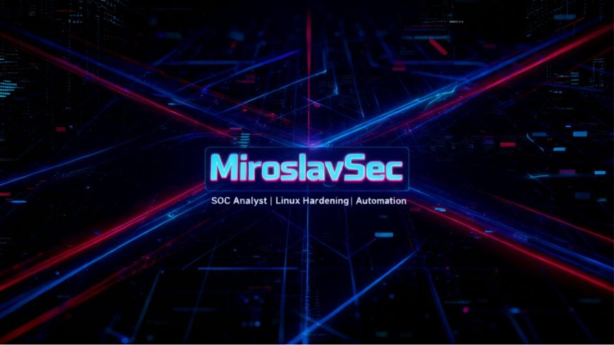

# 🛡️ SOC Analyst Training Lab

**MiroslavSec** — practical cybersecurity portfolio for SOC / Blue Team growth with real lab evidence.
**Developed independently by MiroslavSec. Not affiliated with any educational institution.**

<p align="center">
  
</p>

[](https://github.com/jokeez/SOC-Analyst-Training-Lab)
[](https://github.com/jokeez/SOC-Analyst-Training-Lab)
[](https://www.youtube.com/@MiroslavSec1)

[](https://github.com/jokeez/SOC-Analyst-Training-Lab/commits)
[](https://github.com/jokeez/SOC-Analyst-Training-Lab)
[](https://github.com/jokeez/SOC-Analyst-Training-Lab/issues)
[](https://github.com/jokeez/SOC-Analyst-Training-Lab/stargazers)

[](https://github.com/jokeez/SOC-Analyst-Training-Lab)
[](https://www.linkedin.com/in/miroslav-u-7152233b5/)
[](https://www.youtube.com/@MiroslavSec1)

> Building public, repeatable SOC skills: attack simulation, defensive validation, and clear documentation.

---

## 🎯 Objective

Build practical evidence of security skills through:

- Linux hardening labs  
- Offensive and defensive tool series  
- TryHackMe daily practice  
- Public documentation and videos

This repository is **portfolio-first**: every block shows **what was done**, **how it was validated**, and **what defensive takeaway was learned**.

---

## 🧭 Quick navigation

- [Tracks overview](#-tracks-overview)
- [Progress dashboard](#-progress-dashboard)
- [Current focus](#-current-focus)
- [Video index](#-video-index)
- [Purple engine](#-purple-engine)
- [Repository structure](#-repository-structure)
- [Quick start](#-quick-start)
- [Portfolio and profiles](#-portfolio--profiles)

---

## 📊 Tracks overview


| Track                     | Scope                                                                     | Status                       |
| ------------------------- | ------------------------------------------------------------------------- | ---------------------------- |
| **Linux Hardening**       | UFW, SSH hardening, banners, agent forwarding, Fail2Ban, final automation | ✅ **01–06** (docs + scripts) |
| **Red Team (Offensive)**  | Nmap (Labs 01–06 on video), Hydra (Lab 00 on video; more planned)         | 🚧 In progress               |
| **Blue Team (Defensive)** | Detection, hardening, logging, and incident mini-cases                    | 🧱 Building                  |
| **SOC expansion**         | Windows/AD, logging, SIEM, incident mini-cases                            | ⏳ Planned                    |


---

## 📈 Progress dashboard


| Series          | Labs total    | Published                  | In repo | Status            |
| --------------- | ------------- | -------------------------- | ------- | ----------------- |
| Linux Hardening | 06            | 05 videos + 01 docs/script | ✅       | 🟢 Stable         |
| Nmap            | 06            | 06 videos                  | ✅       | 🟢 Complete block |
| Hydra           | 00+           | 01 video (Lab 00)          | ✅       | 🟡 Expanding      |
| Defensive Blue  | planned block | 0 public labs              | 🧱      | 🔵 Design phase   |


> Target rhythm: steady weekly releases with one-tool-per-series discipline.

---

## 🚢 What is shipping now

- Nmap core block is published end-to-end (Labs 01-06).
- Hydra `00-speed-vs-detection` is now part of the offensive pipeline.
- Shared orchestration scripts are kept in repo for reproducible execution.
- Documentation style is unified around scenario -> validation -> takeaway.

---

## 🔥 Current focus

- Daily: TryHackMe learning and notes  
- Weekly: batch recording and scheduled publishing  
- Rule: **one tool per series** (no mixing tools in one video block)

---

## 📺 Video index

Where a lab has a walkthrough, the link is below. **Shared / orchestration scripts** (Linux Lab 06 `auto-secure.sh`, Nmap `nmap-labs-menu.sh`) stay **GitHub-only** — documented here, not as a separate video.

### Linux Hardening


| #   | Lab                  | Video / materials                                                    |
| --- | -------------------- | -------------------------------------------------------------------- |
| 01  | Firewall (UFW)       | [▶️ Watch](https://youtu.be/zgGrlMZAEcM)                             |
| 02  | SSH Keys             | [▶️ Watch](https://youtu.be/ULZVP8h6Uvc)                             |
| 03  | Security Banners     | [▶️ Watch](https://youtu.be/ILBxHbIw74Y)                             |
| 04  | SSH Agent Forwarding | [▶️ Watch](https://youtu.be/NOCivaFgoXc)                             |
| 05  | Fail2Ban             | [▶️ Watch](https://youtu.be/KGf3O-4LXkQ?si=MVaqIkHsp7_x4Et6)         |
| 06  | Final Automation     | [Docs + `auto-secure.sh](./Linux-Hardening/Lab06-Final-Automation/)` |


### Nmap (published)


| #   | Lab                                | Video / materials                                                |
| --- | ---------------------------------- | ---------------------------------------------------------------- |
| 01  | Host Discovery + Fast Scan         | [▶️ Watch](https://youtu.be/abxydAApkko)                         |
| 02  | SYN Scan Basics                    | [▶️ Watch](https://youtu.be/vPJW-t86lgc)                         |
| 03  | Service Detection                  | [▶️ Watch](https://youtu.be/vn8LKGCSVQk)                         |
| 04  | Speed vs Depth                     | [▶️ Watch](https://youtu.be/uDrDLcGPx1A)                         |
| 05  | Output & Reporting                 | [▶️ Watch](https://youtu.be/Jk_YhxfHPCw)                         |
| 06  | Safe NSE Intro                     | [▶️ Watch](https://youtu.be/wZI1miGav1w?si=kNtczLp2BnUpQLrL)     |
| —   | Interactive menu (runs Labs 01–06) | [Docs + `nmap-labs-menu.sh](./labs/offensive-red/nmap/scripts/)` |


### Hydra (published)


| #   | Lab                                                    | Video                                    |
| --- | ------------------------------------------------------ | ---------------------------------------- |
| 00  | Speed vs detection (local range, rate limit / lockout) | [▶️ Watch](https://youtu.be/H16hmZXzrYA) |


---

## 🟣 Purple Engine

This portfolio follows a **Purple Team workflow**:

- **Red (offensive):** discover and simulate realistic attack techniques.
- **Blue (defensive):** detect, harden, and validate mitigations.
- **Purple (bridge):** connect attack evidence to concrete defensive actions.

### Traceability Matrix (Attack → Defense)


| Attack phase (Red)       | Tool / technique                   | Detection / mitigation (Blue)                       | Lab evidence                                                                                                          |
| ------------------------ | ---------------------------------- | --------------------------------------------------- | --------------------------------------------------------------------------------------------------------------------- |
| Network recon            | `nmap -sn`, `nmap -sV`             | Service minimization, banner strategy, segmentation | [Nmap Lab 01–03](./labs/offensive-red/nmap/)                                                                          |
| Port exposure mapping    | SYN scan (`-sS -Pn`)               | Firewall rule review + exposure baseline            | [Nmap Lab 02](./labs/offensive-red/nmap/02-syn-scan/)                                                                 |
| Brute-force simulation   | Hydra (web lab + SSH track)        | Fail2Ban + SSH keys + hardening policy              | [Hydra Lab 00](./labs/offensive-red/hydra/00-speed-vs-detection/) · [Linux Lab 05](./Linux-Hardening/Lab05-Fail2Ban/) |
| Safe service enumeration | NSE `--script safe`                | Logging + anomalous pattern monitoring              | [Nmap Lab 06](./labs/offensive-red/nmap/06-safe-nse/)                                                                 |
| SSH hardening validation | Key-only auth / custom port checks | `sshd_config` policy + UFW + backup-and-verify flow | [Linux Lab 02/03/06](./Linux-Hardening/)                                                                              |


### Lab Standard

Every lab should follow the same engineering format:

1. **Scenario** — what problem is being solved?
2. **Scope & authorization** — lab-only and authorized targets.
3. **Reproduction (Red)** — how the issue is observed.
4. **Remediation (Blue)** — fix/hardening steps.
5. **Verification** — proof that behavior changed after fixes.
6. **Artifacts** — scripts, command logs, or reports.
7. **Defensive takeaway** — SOC-relevant conclusion.
8. **MITRE ATT&CK mapping** — 1-3 techniques with detection + mitigation notes.

Template: `[labs/LAB_TEMPLATE.md](./labs/LAB_TEMPLATE.md)`

---

## 📁 Repository structure


| Path                                             | Purpose                                           |
| ------------------------------------------------ | ------------------------------------------------- |
| `[Linux-Hardening/](./Linux-Hardening/)`         | Linux series (labs 01–06)                         |
| `[labs/offensive-red/](./labs/offensive-red/)`   | Red Team tools and workflows (Nmap/Hydra/...)     |
| `[labs/defensive-blue/](./labs/defensive-blue/)` | Blue Team detections, mitigations, and case notes |
| `[labs/LAB_TEMPLATE.md](./labs/LAB_TEMPLATE.md)` | Standard template for consistent lab quality      |
| `[docs/](./docs/)`                               | Portfolio site (GitHub Pages)                     |
| `[scripts/](./scripts/)`                         | Shared automation helpers                         |
| `[ROADMAP.md](./ROADMAP.md)`                     | High-level timeline and next steps                |
| `[LICENSE](./LICENSE)`                           | MIT — code and docs in this repo                  |


---

## ✅ Content standards

- One video = one main skill.  
- One series = one tool (no tool mixing).  
- Lab docs use named markdown files (`LABxx.md` or `Labxx-*.md`).  
- Each lab includes: objective → steps → validation → **defensive takeaway** (purple angle where it fits).

---

## 🚀 Release workflow

1. Publish or schedule the lab video.
2. Sync documentation and public links in repository and website.
3. Keep titles and naming consistent across GitHub, website, and playlist.

---

## ⚙️ Quick start

```bash
git clone https://github.com/jokeez/SOC-Analyst-Training-Lab.git
cd SOC-Analyst-Training-Lab
```

Open the lab folder you need and follow its markdown guide.

### Linux Hardening — master script (final runbook)

After you understand each step, you can chain **labs 02 + 03 + 01 + 05** in one safe order (SSH **2222**, UFW, Fail2Ban stay aligned):

```bash
cd Linux-Hardening/Lab06-Final-Automation
chmod +x auto-secure.sh
./auto-secure.sh
```

- **Write-up:** `[Lab06-Final-Automation.md](./Linux-Hardening/Lab06-Final-Automation/Lab06-Final-Automation.md)`  
- **Order:** Lab 02 (keys) → Lab 03 (port/banner) → Lab 01 (UFW) → Lab 05 (Fail2Ban). Lab 04 is **client-side** only.  
- **Before:** your public key in `~/.ssh/authorized_keys` and a tested SSH login; keep a spare session open.

---

## 🌐 Portfolio & profiles

- **Website:** [MiroslavSec](https://jokeez.github.io/SOC-Analyst-Training-Lab/)  
- **Certification museum:** [Certifications](https://jokeez.github.io/SOC-Analyst-Training-Lab/certifications.html)  
- **TryHackMe:** [MiroslavSEC](https://tryhackme.com/p/MiroslavSEC)  
- **YouTube:** [MiroslavSec1](https://www.youtube.com/@MiroslavSec1)  
- **LinkedIn:** [miroslav-u-7152233b5](https://www.linkedin.com/in/miroslav-u-7152233b5/)

---

## 🤝 Collaboration

If you are building your own SOC path, feel free to open an issue or drop feedback on lab structure, detection notes, or workflow ideas.